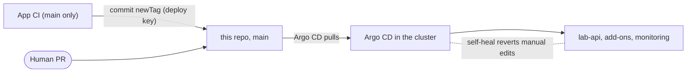

# cloud-lab-platform-gitops

The **desired state** of what runs in the clusters. Argo CD pulls this repository and applies it; nothing is
ever pushed into a cluster from CI or from a laptop.

Part of a three-repository platform:
[infra](https://github.com/amerveus/cloud-lab-platform-infra) |
[app](https://github.com/amerveus/cloud-lab-platform-app) |
**gitops** (this repo).



## Layout

```
argocd/
  root.yaml                  dev bootstrap: the ONLY thing applied by hand
  apps/                      dev Applications (one file each)
    lab-api-dev.yaml  aws-load-balancer-controller.yaml  external-secrets.yaml
    secret-store.yaml  kube-prometheus-stack.yaml  monitoring-config.yaml
  prod/
    root.yaml                prod bootstrap (separate cluster, separate Argo CD)
    apps/lab-api-prod.yaml
apps/lab-api/
  base/                      what EVERY environment can run
                             namespace (Pod Security restricted), service account,
                             hardened Deployment (probes, spread, preStop), Service
  overlays/dev/              config, replicas, image tag, Ingress, ExternalSecret, ServiceMonitor
  overlays/prod/             config and the promoted image tag only
platform/
  secret-store/              ClusterSecretStore for Secrets Manager (Pod Identity)
  monitoring/                alert rules, Grafana admin secret, dashboard as code
```

## How a change reaches a cluster

1. **App change:** merging to the app repo's `main` builds and scans an image, pushes it to ECR, then CI commits
   a new `newTag` to `apps/lab-api/overlays/dev/kustomization.yaml`. That line is **owned by CI**.
2. **Anything else:** a pull request here. Argo CD syncs after merge (about 3 minutes; hard-refresh to speed
   it up).
3. **Prod:** a reviewed pull request that sets the prod overlay's `newTag` to a SHA already running in dev.
   That one line is the promotion.

Every Application uses automated sync with **prune** and **self-heal**. Scaling the deployment to 5 by hand
is reverted to 2 within about a second.

## Rules this repo follows

- **The base holds only what every environment can run.** A ServiceMonitor needs the Prometheus CRDs, so it
  lives in the dev overlay; prod has no Prometheus yet. (This was a real mistake that was fixed before it
  broke prod; the render diff before and after the move was empty.)
- **`configMapGenerator` adds a content hash to the ConfigMap name,** so changing a value renames the
  ConfigMap and rolls the pods. A plain ConfigMap edit would never reach running pods.
- **Pods are hardened:** non-root, read-only root filesystem, all capabilities dropped, seccomp default, and
  the namespace enforces Pod Security `restricted`.
- **Zero-downtime rollouts behind the ALB:** the namespace label `elbv2.k8s.aws/pod-readiness-gate-inject`
  makes a pod ready only after the ALB reports it healthy; a 15 second `preStop` sleep and a 30 second
  deregistration delay drain old pods. A rolling restart under steady load returned 50 of 50 HTTP 200.
- **No secrets here.** Values live in Secrets Manager; External Secrets syncs them.

## Bootstrapping a cluster

See [docs/bootstrap.md](docs/bootstrap.md). In short: install Argo CD with Helm, then
`kubectl apply -f argocd/root.yaml`. Everything else follows from Git.

## Values that a rebuild invalidates

Three values are hard-coded here and change when the dev environment is rebuilt:

| Value | File |
|---|---|
| VPC id | `argocd/apps/aws-load-balancer-controller.yaml` (`vpcId`) |
| WAF web ACL ARN | `apps/lab-api/overlays/dev/ingress.yaml` (`wafv2-acl-arn`) |
| Ops host private IP | `argocd/apps/kube-prometheus-stack.yaml` (`additionalScrapeConfigs`) |

Next step: render them from Terraform outputs.

## Known gaps

- `lab-api-dev` has no `retry` block, so a first sync that races the Prometheus CRDs needs one manual Sync.
  Sync waves are the formal fix.
- Prod does not yet run the load balancer controller, External Secrets or monitoring.
